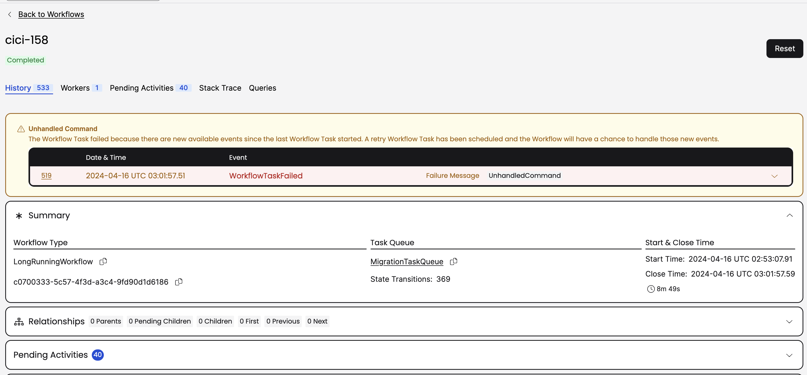

# migration : interceptor

This suite of interceptors can be configured in your current Workers to perform a migration to another namespace.

## How It Works

The [Worker Interceptor](MigrationWorkerInterceptor.java) manages its own `CancellationScope` to perform a cancellation on-demand when 
a WorkflowType which is deemed `isMigrateable` by your `Migrator` implementation. 

Cancellation of the legacy workflows will hence start the migration. This is done by sending a batch `migrateIt` signal using the
Temporal CLI. 

During this cancellation it will invoke your `migrate` implementation inside this scope, passing along the result of the `Query` you expose, 
so that the execution is effectively "resumed" in the target Namespace.

Signals could arrive while the new execution is being started in the target Namespace, 
so these can be forwarded along to the execution in the target Namespace. See the `forwardSignal` method in the sample.

Workflows in the legacy Namespace will be `Completed` (swallowing the `CanceledFailure`) with the result of the `Query` described previously.

## Getting Started

1. Extend your Workflow with a query, introducing a WorkflowInterface with this Query defined. 
   1. Sample interface is [here](../example/QueryableLongRunningWorkflow.java).
1. Implement this interface on the Workflow Type(s) to be migrated
1. Implement the `interceptor.Migrator` interface
   1. **Note** that the migrator is invoked _inside a Workflow Thread_ so is subject to typical constraints (eg invoking Temporal Client APIs are forbidden).
   1. See a [sample MigratorImpl](../example/MigrationImpl.java) for the appropriate way to invoke (inside a LocalActivity)
      the `start` of an execution in the target Namespace.
1. Configure your Workers servicing the *legacy* namespace to use the [Worker Interceptor](MigrationWorkerInterceptor.java), passing in your `Migrator` implementation. 
   1. See the [sample](../example/LegacyWorker.java) for configuring the Worker with an interceptor.

## What happens to Signals coming in while migration is taking place?

If a Signal is received by Temporal service while the interceptor is invoking your `Migrator` implementation, the Temporal
service will reply with an `UnhandledCommand` error when the current Task tries to Complete. This will allow the Worker
to get the buffered signal(s), apply them to the Workflow Execution, then retry the Cancel task. You'll see something like this
in the Web UI for the execution:

> Unhandled Command

> The Workflow Task failed because there are new available events since the last Workflow Task started. A retry Workflow Task has been scheduled and the Workflow will have a chance to handle those new events.

